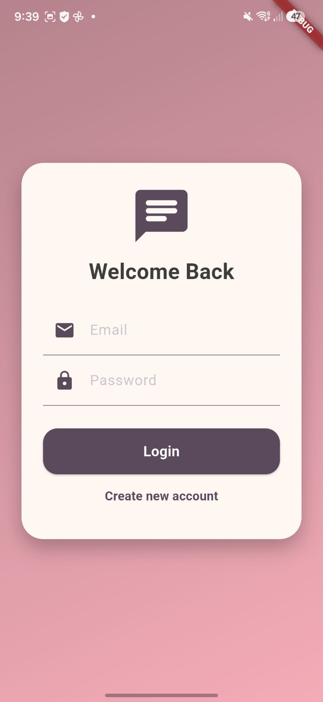
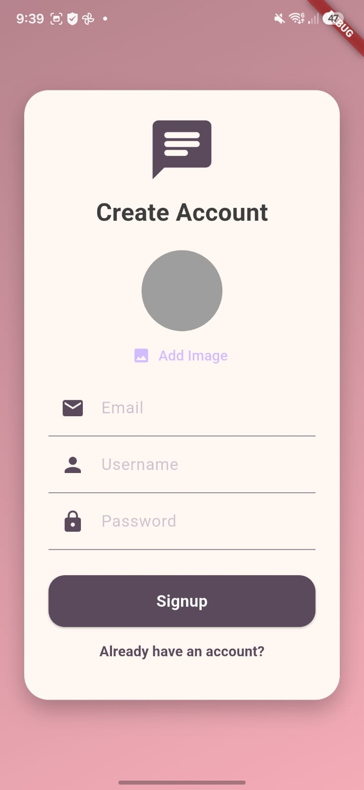
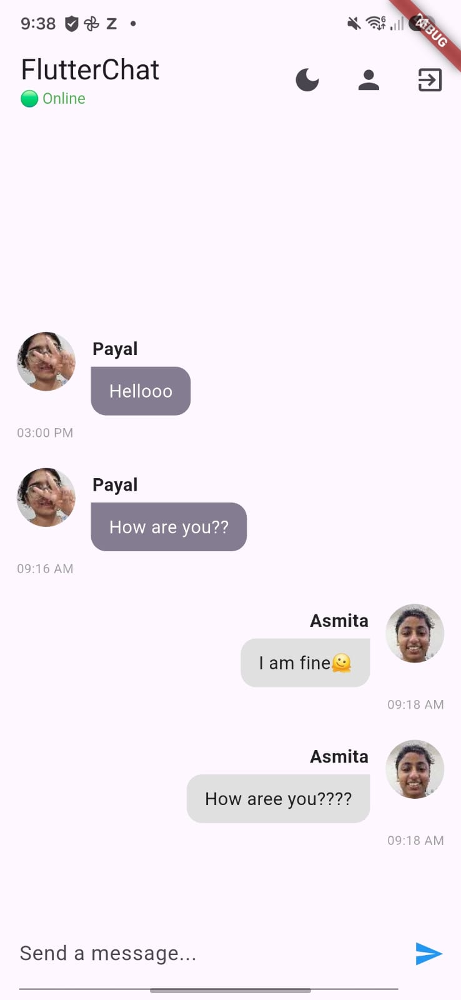
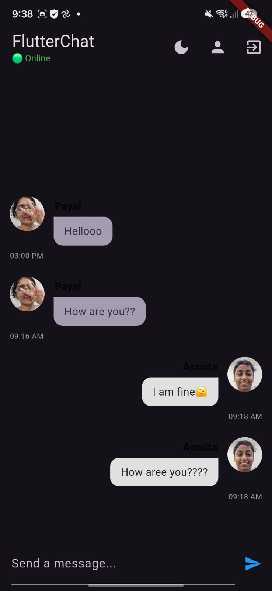

# 💬 Flutter Chat App

A modern real-time messaging application built using **Flutter**, **Firebase**, and **Cloudinary**. The application enables users to securely authenticate, exchange instant messages, and share images through a clean, responsive, and intuitive user interface.

---

## 🚀 Overview

Flutter Chat App is a cross-platform messaging application developed to strengthen my Flutter development skills while exploring backend integration with Firebase.

The project demonstrates:

- Secure user authentication
- Real-time messaging
- Cloud database integration
- Image uploading
- Responsive UI design

To avoid Firebase Storage billing requirements, image uploads were implemented using **Cloudinary** while continuing to use **Firebase Authentication** and **Cloud Firestore**.

---

## ✨ Features

- 🔐 Secure Authentication
- 👤 User Registration & Login
- 💬 Real-Time One-to-One Messaging
- 🖼 Image Sharing with Cloudinary
- ☁ Cloud Firestore Integration
- 📱 Responsive Material UI
- ⚡ Instant Message Updates
- 🔒 Secure Cloud-Based Backend

---

## 🛠 Tech Stack

### Frontend
- Flutter
- Dart

### Backend
- Firebase Authentication
- Cloud Firestore

### Cloud Storage
- Cloudinary

### UI
- Material Design

---

## 📦 Packages Used

- firebase_core
- firebase_auth
- cloud_firestore
- cloudinary_public
- image_picker

---

## 🏗 Architecture

```text
Flutter App
      │
      ▼
Firebase Authentication
      │
      ▼
Cloud Firestore
      │
      ▼
Cloudinary
```

---

# 📸 Screenshots

<table>
<tr>
<td align="center">
<b>Login Screen</b><br><br>

</td>

<td align="center">
<b>Sign Up & Image Upload</b><br><br>

</td>
</tr>

<tr>
<td align="center">
<b>Chat Screen</b><br><br>

</td>

<td align="center">
<b>Profile Screen</b><br><br>

</td>
</tr>

<tr>
<td colspan="2" align="center">
<b>Dark Mode Chat</b><br><br>

</td>
</tr>
</table>

---

## 📂 Project Structure

```text
lib/
│
├── screens/
│   ├── auth/
│   └── chat/
│
├── widgets/
├── services/
├── models/
├── utils/
└── main.dart
```

---

## ⚙️ Installation

### Clone Repository

```bash
git clone https://github.com/payalchopade27/flutter-chat-app.git
```

### Navigate to Project

```bash
cd flutter-chat-app
```

### Install Dependencies

```bash
flutter pub get
```

### Run the Application

```bash
flutter run
```

---

## 🔥 Challenges Solved

During development, Firebase Storage required enabling billing for image uploads.

Instead of enabling Firebase Storage billing, **Cloudinary** was integrated for image uploads while continuing to use:

- Firebase Authentication
- Cloud Firestore

This approach maintained all application functionality while avoiding additional cloud storage costs.

---

## 🎯 Learning Outcomes

This project helped me gain practical experience in:

- Flutter App Development
- Firebase Authentication
- Cloud Firestore
- Cloudinary Integration
- Image Uploading
- Real-Time Database Management
- Responsive UI Design
- Mobile App Architecture
- REST API Integration

---

## 🔮 Future Improvements

- 👥 Group Chats
- 📞 Voice & Video Calling
- 😀 Emoji Reactions
- ❤️ Message Reactions
- 🔍 Chat Search
- 🌙 Theme Customization
- 🔔 Push Notifications
- 🟢 Online Status
- 📌 Pinned Messages

---

## 🤝 Contributing

Contributions, suggestions, and improvements are welcome.

Feel free to fork this repository and submit a Pull Request.

---

## 👩‍💻 Developer

**Payal Sandeep Chopade**

Computer Engineering Student | VIT Pune

Flutter Developer • Learning Backend • Exploring AI & MLOps

---

## ⭐ Show Your Support

If you found this project useful, consider giving it a ⭐ on GitHub!
